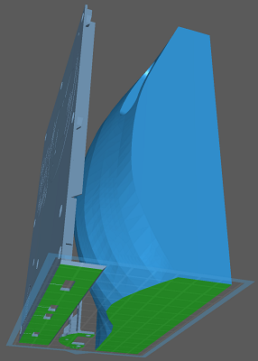

Wotafk40 - A Scratchbuild Keyboard
==================================

(c) 2022 ムムム製作所

***NOTE: Wotafk40 is not for beginners.
You will need a deep understanding of
3D-printing and Raspberry Pi-based electronics development
to build and make it work successfully.***

このリポジトリでは自作キーボード『Wotafk40』(おたふく40)の全体概要を説明するファイルだけを公開しています。
Wotafk40を作成するために必要なハードウェアやソフトウェアのファイルはそれぞれ別のリポジトリにあります。
このREADMEの下の方でリンクしていますので、このREADMEを全て読んでいただいた上で、
アクセスして下さい。

スイッチから作る自作キーボード
------------------------------

Wotafk40は、PC用のキーボードを自分で好きなように造り上げようという、
いわゆる「自作キーボード」のムーブメントの1つに位置づけられるキーボードです。

自作キーボードには、既製品のキーボードのキーキャップを交換するレベルの物から、
キーのレイアウトから設計して、使用する部品も選び抜いてハードウェアを組み上げたり、
ファームウェアにも手を入れたりして、
自分の求める使い勝手や、あるいは審美性を実現したりと、
いろいろなレベルがあります。

ただ、それら多くの自作キーボードは、
スイッチは既製品を用いる、という点ではほぼ共通していました。
これはスイッチこそがキーボードで最も大事なメカニカル部品であり、
その設計や工作精度が使い心地や信頼性、耐久性を左右するからです。
だから実績のある設計をベースに工業的に精度良く作られたものが安価に得られるのでしたら、
それを使わない手はありません。

でも、既製品のスイッチを使うということは、
その備える機能やフォームファクタ(形状)にキーボードを合わせないといけない、
という不自由も抱えることになります。
例えば、キー間隔をもっと狭くしたいと考えても、
スイッチ同士がぶつかってしまえばそれ以上は狭くできません。

Wotafk40は
__『スイッチから設計し直せるなら、どんなキーボードが作れるだろう？』__
という発想からスタートしました。
それからまあ、ホビーで3D CADを使いだして1年くらいの素人が、
独自のスイッチを悪戦苦闘して設計したのですが、
それでもいろんな工夫を盛り込んだつもりです：

+ 最小9mmのスイッチ間隔
+ 電気的接点無し -- 光学式の押下量検出 (カメラで複数のスイッチを同時撮影して画像分析してます)
+ ほぼ全ての部品を3Dプリンタで作成可能 (MX互換スイッチ用のスプリングのみ別途必要です)
+ キーキャップのロック機構 (上記スプリングを二重に活用しています)
+ スイッチの底面がひし形 (筐体側の挿入孔を3Dプリンタでサポート無しでも高精度に形成できるように)

")

この独自の光学スイッチを活かすことで、Wotafk40はキーボードとしては、

+ [x] パーム(手のひら)を置いたままですべてのキーを打てる
      -- キー間隔が狭いので指の動きだけですべてのキーを打ち分けできる。
      親指は指先と第一関節の打ち分けで5キーを担当。
      また、パームを浮かさないので手首や腕が疲れにくく、位置が定まるのでミスタッチも起こりにくい。
+ [x] キーの押下量とon/offの対応づけ(どこまで押し込んだらonになるか)をキーごとにチューニングできる
+ [x] 組み立てには半田付けは(ほとんど)不要
+ [x] 筐体は3Dプリンタの1回のプリントで出力可能(左右分割の片方ずつですが)
+ [x] 自分の手指の大きさやリーチに合わせたチューニングが容易
      (筐体の再設計や3Dプリントのやり直しが必要ですが、
       プリント基板を再設計して最小ロット製造するよりは手軽でしょう)

…というような長所を得ています
(下図のとおり開発者の所でも未完成な状態で言っている事なので眉唾で受け取ってください)。

")

他方で現在の所の短所としては、

- [ ] スイッチの操作感や信頼性が、既製品のスイッチに遠く及ばない
- [ ] その割にスイッチの組み立てが面倒で、3Dプリントもパラメタの追い込みが必要
- [ ] 押下検知用カメラのフレームレートの都合上、キー操作がPCに伝わるまでの遅延が大きく、
      特にゲーム用途には向かない
- [ ] いわゆるゲーミングキーボードっぽく光らせられないので、見た目が地味
      (光学的にキー押下を検知するので、下手に光らせると誤検知に繋がるのです)

最後のはともかくとして、このようにWotafk40は現状では実用になるキーボードでは全くなく、
様々な実験的要素を盛り込んだProof of Concept (PoC)機である、と認識していただいた方が正しいです。
しかも、組み上げて動作できるようにするためには、

* 3Dプリンタを用いて、嵌合する機構部品を設計段階から作成したことがある
* Raspberry Piを使って外付けのLED(2本足のやつ)を思い通りに点滅させるくらいの回路とソフトを作れる

…くらいのスキルは必要です。
開発者の文章力や、ドキュメントを充実させようという熱量も不足していますので、
上手くいかない場合にはご自身で原因を突き止めて対応できないといけません。
__決して初心者向けの自作キーボードではありません__
ので、ご注意ください。

主要な必要機材
--------------

ここでは主にどんな機材や材料をそろえないと、
Wotafk40を作ることができないのかを大まかに示します。
ハードルの高さ感覚を理解して頂くためなので、
ここに書いていないものが製作途中で必要になっても、
「書いてなかったぞ！:angry:」なんて怒らないで下さいね。

### 工具

#### ● 3Dプリンタ -- レジンを紫外線で硬化するMSLA方式のもの

Wotafkの筐体部分だけでしたら3Dプリントをアウトソーシングしてもいいかもしれません。
でも、スイッチは部品間のクリアランスが大事です。
公開しているスイッチのSTLデータも、
「開発者の3Dプリンタではこれで動いている」
というだけのものなので、アウトソース先のプリンタだと相対的に肉厚で
部品がスムーズに動かなかったり嵌合しなくなるかもしれません。
自分で所有する、使い慣れた3Dプリンタで出力パラメタを追い込んでいただいた方が、
きちんと動く可能性が高まると思います。

MSLA方式を推しているのは、開発者がそれを使って開発しているからです。
ちなみに開発者が現在使っているのは
[Elegoo Mars 2](https://www.elegoo.com/products/elegoo-mars-2-pro-mono-lcd-3d-printer)
ですが、設計初期の段階では
[Anycubic Photon (初代)](https://www.anycubic.com/collections/anycubic-photon-3d-printers/products/anycubic-photon-3d-printer)
を使っていたので、それで出力できるように筐体のサイズを抑えています。
なので、初代Photon以降の大抵のMSLA方式プリンタで出力できるのではないかと思います。
しかし、FDMなど他の方式のプリンタで作れるのかどうかについては、
試したことが無いので全く分かりません。

##### ・フレキシブルビルドプレート aka ばね鋼板

MSLA方式プリンタを使った製作には、ポストキュアのためのUV光源や、
余剰レジンの洗浄用のアルコールや水、その廃液の処理容器、
ソフトウェア的にはSTLファイルを変換するソフトなど、
一般的に必要となる周辺機材やツールがありますが、それらについてはいちいち触れません。
ここで取り上げるのは、あまり一般的ではないけどWotafkではほぼ必須のものについてです。

ばね鋼板は、Wotafk製作にほぼ必須のMSLAプリンタのアドオンです。
公開しているWotafkのSTLファイルは、
MSLAプリンタのプラットフォームにサポートなしにベタ付けで形成されることを想定しています(下図)。
ですのでばね鋼板を使わないと、
プリントした部品がプラットフォームに直接べったりと張り付いて出来上がります。
それをプラットフォームから剥がすのは結構大変ですので、
その挙句にせっかく出力した部品を壊したり、プラットフォームを損傷することになるかもしれません。

なお、ばね鋼板を取り付けることでプリンタのZ軸の可動範囲が変わりますので、
LCDやレジンvatを破損しないようにプリンタの調整や改造が一般的には必要です。
ご注意ください。

#### ● 半田ごて

Wotafk製作に半田付けはほとんど必要ないのですが、
筐体の内部を照らすLEDと電流制限抵抗器とを繋ぐところだけ半田付けしています。
(この箇所だけですので、LEDと抵抗器の足同士を上手くひねって接続すれば何とかなるかも。)

### 材料

#### ● MSLAプリンタ用UVレジン(黒色)

使用するMSLAプリンタに適合するUVレジン。
量としては500gもあれば一通りの試作は出来ますが、
どれだけ試行錯誤を繰り返すかにより最終的に必要な量は変わってきます。

レジンの色は不透明の黒色があればそれを。
Wotafk40の筐体だけでなく、スイッチを含めて全てこの色のレジンを使います。
これは外部からの光が筐体等を透過してカメラに差し込んでノイズとなるのを防ぐためです。
開発者は
[SIRAYA Fast](https://siraya.tech/products/fast-abs-like-grey)
の特性が気に入っているのですが、
黒色はSmoky Black (半透明の黒)しかなくて遮光性が良くないので、
それに黒色顔料を添加して使っています。

#### ● Raspberry Pi Zero W

カメラからの画像データを解析して、
PCから見てキーボードとして扱えるような信号に変換する処理を行うロジックボードとして、
Raspberry Pi Zero Wを使っています。
Wotafk40は左右分割キーボードですので、左右それぞれに1個、合わせて2個必要です。

すでに後継のZero 2 Wも販売されていますが、
PoCとしてはそこまでの処理能力は必要ないので、Zero Wでも十分です。
カメラを高解像度にしたり、フレームレートを上げたりするには
Zero 2が必要になるかもしれませんが、同時に熱対策も必要になりそうですね。

これを書いている2022年終盤の時点では、
半導体不足の影響でZero 2 WだけでなくZero Wまで入手困難な状況ですが、
2023年の第2四半期には
[回復見込み](https://www.raspberrypi.com/news/supply-chain-update-its-good-news/)
だそうです。

#### ● Raspberry Pi用カメラ (160度FoV)

Wotafk40の筐体内でスイッチの動きを撮影するためのカメラ。
これも2個必要です。
必要な諸元としては、

* Raspberry PiとCSIインタフェースで接続できる
* 160度FoVの魚眼レンズ (全てのスイッチを画角に収めるため)
* 基板サイズ25mm x 24mm (それ以上大きいとカメラステイに乗りませんし、筐体に入りません)
* 基板四隅のネジ穴に3.3Vが来ている (LEDを繋げて照明するため)

具体的な商品としては(2つは多分同一のものではないかと思います)、

* [Spotpear - Raspberry Pi Camera 160,5 megapixel OV5647](https://www.spotpear.com/index/product/detail/id/222.html)
* [Waveshare - RPi Camera (G), Fisheye Lens](https://www.waveshare.com/product/raspberry-pi/cameras/5m-pixels/rpi-camera-g.htm)

などが、いろんなショップで入手できると思います。

#### ● Pi Zero用カメラケーブル (長さ > 15cm)

上記のPi ZeroのCSIポートとカメラとを接続するケーブル。2本必要です。
カメラを買うと長さ15cmのケーブルが付属している場合がありますが、
15cmだとぎりぎりなので、もっと長いものを入手した方がいいです。
(しかし、15cmの上は30cmとなってしまうようで、今度はちょっと余り過ぎるのですが、
仕方なく使ってます。)

#### ● MX互換スイッチ用のコイルスプリング (35g程度のもの)

Riskable氏のvoid_switchではスイッチの押下反力に永久磁石の反発力を用いていますが、
Wotafk40のスイッチはその点では冒険せずに、
MXスイッチの部品交換用に市販されているコイルスプリングを用いています。
スイッチごとにスプリング1個使います。
Wotafk40は左右合わせて40個のスイッチが必要ですので、スプリングも40個必要です。
どのくらいの反発力のものを選ぶかについては、
「35g」と表示されているものを基準にしてください。
WotafkのスイッチはMXよりスプリングを圧縮気味に使っているので、
35gのスプリングでMXの50g程度の感触になると思います(測定していないので、感覚的なものですが)。

リポジトリ
----------

ここまで読んでいただいて、それでもWotafk40にご興味があるようでしたら、
どうぞ以下のリポジトリをご参照ください。

### [Wotafk40_HW](https://github.com/mumumufactory/Wotafk40_HW) - Wotafk40 Hardware

Wotafk40のハードウェア製作に必要なファイルを公開しています。
独自スイッチ、筐体、カメラステイのSTLファイルが含まれます。

### Wotafk40_SW - Wotafk40 Software (Under development. 近日公開予定)

Wotafk40に搭載のRaspberry Pi Zero上で動かして、
PCから見てUSBキーボードとして振舞わせるためのソフトウェアを公開予定です。
